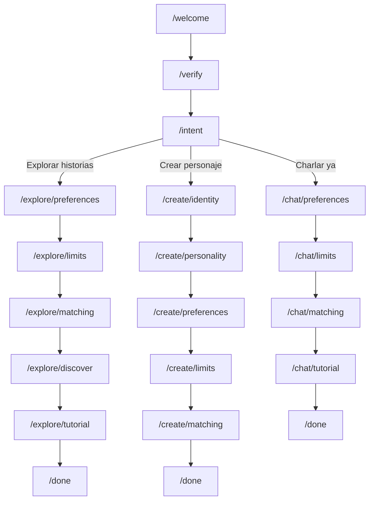

# Intent-Based Flow Branching + File Reorganization

After intent selection ("¿Qué querés vivir hoy?"), the onboarding branches into 3 distinct paths depending on what the user chose.

## Flow Architecture

### Flow: Explorar historias (`explore`)
`/welcome` → `/verify` → `/intent` → `/explore/preferences` → `/explore/limits` → `/explore/matching` → `/explore/discover` → `/explore/tutorial` → `/done`

### Flow: Crear personaje (`create`)  
`/welcome` → `/verify` → `/intent` → `/create/identity` → `/create/personality` → `/create/preferences` → `/create/limits` → `/create/matching` → `/done`

### Flow: Charlar ya (`chat`)
`/welcome` → `/verify` → `/intent` → `/chat/preferences` → `/chat/limits` → `/chat/matching` → `/chat/tutorial` → `/done`

> [!NOTE]
> All 3 flows reuse the same screen components — the path just determines the **order** and which screens are **included/skipped**.

## File Reorganization

### Current → New (rename + cleanup)

| Current File | New Path | URL Path | Screen |
|---|---|---|---|
| [01-welcome.js](file:///f:/Proyectos/Sexteo.com/ONBOARDING/src/screens/01-welcome.js) | `screens/welcome.js` | `/welcome` | Landing page |
| [02-age-verify.js](file:///f:/Proyectos/Sexteo.com/ONBOARDING/src/screens/02-age-verify.js) | `screens/verify.js` | `/verify` | Age + consent |
| [03-intent.js](file:///f:/Proyectos/Sexteo.com/ONBOARDING/src/screens/03-intent.js) | `screens/intent.js` | `/intent` | 3 options |
| [04-limits-style.js](file:///f:/Proyectos/Sexteo.com/ONBOARDING/src/screens/04-limits-style.js) | `screens/preferences.js` | `/{flow}/preferences` | Intensity, styles, interaction |
| [04-limits-boundaries.js](file:///f:/Proyectos/Sexteo.com/ONBOARDING/src/screens/04-limits-boundaries.js) | `screens/limits.js` | `/{flow}/limits` | Content toggles |
| [05-character-identity.js](file:///f:/Proyectos/Sexteo.com/ONBOARDING/src/screens/05-character-identity.js) | `screens/identity.js` | `/create/identity` | Avatar + name + desc |
| [05-character-personality.js](file:///f:/Proyectos/Sexteo.com/ONBOARDING/src/screens/05-character-personality.js) | `screens/personality.js` | `/create/personality` | Traits + AI gen |
| [06-matching.js](file:///f:/Proyectos/Sexteo.com/ONBOARDING/src/screens/06-matching.js) | `screens/matching.js` | `/{flow}/matching` | Radar animation |
| [07-first-experience.js](file:///f:/Proyectos/Sexteo.com/ONBOARDING/src/screens/07-first-experience.js) | `screens/discover.js` | `/explore/discover` | Story/user/room selection |
| [08-tutorial.js](file:///f:/Proyectos/Sexteo.com/ONBOARDING/src/screens/08-tutorial.js) | `screens/tutorial.js` | `/{flow}/tutorial` | Chat simulation |
| [09-dopamine.js](file:///f:/Proyectos/Sexteo.com/ONBOARDING/src/screens/09-dopamine.js) | `screens/done.js` | `/done` | Achievement + confetti |

> [!IMPORTANT]
> Files [04-limits.js](file:///f:/Proyectos/Sexteo.com/ONBOARDING/src/screens/04-limits.js) and [05-character.js](file:///f:/Proyectos/Sexteo.com/ONBOARDING/src/screens/05-character.js) (the old unsplit versions) will be **deleted**.

## Proposed Changes

### Intent Screen
#### [MODIFY] [intent.js](file:///f:/Proyectos/Sexteo.com/ONBOARDING/src/screens/03-intent.js)
- Change `onNext` callback to `onIntent(intent)` — passes the selected intent key instead of blindly advancing

---

### App State Machine
#### [MODIFY] [app.js](file:///f:/Proyectos/Sexteo.com/ONBOARDING/src/app.js)
- Replace linear `STEPS` array with a `FLOWS` object defining 3 routes
- Intent screen calls `startFlow(intent)` which picks the right route
- [goTo](file:///f:/Proyectos/Sexteo.com/ONBOARDING/src/app.js#150-191) now navigates by flow route name, not step index
- Aurora progress bar adapts to the current flow's length

---

### File Renames
All screen files renamed to remove number prefixes and match their URL paths (see table above).

---

### Cleanup
#### [DELETE] [04-limits.js](file:///f:/Proyectos/Sexteo.com/ONBOARDING/src/screens/04-limits.js)
#### [DELETE] [05-character.js](file:///f:/Proyectos/Sexteo.com/ONBOARDING/src/screens/05-character.js)

## Verification Plan
- Navigate each of the 3 flows end-to-end
- Confirm the aurora bar adapts to each flow's length
- Confirm shared screens (preferences, limits, matching) work in all flows
