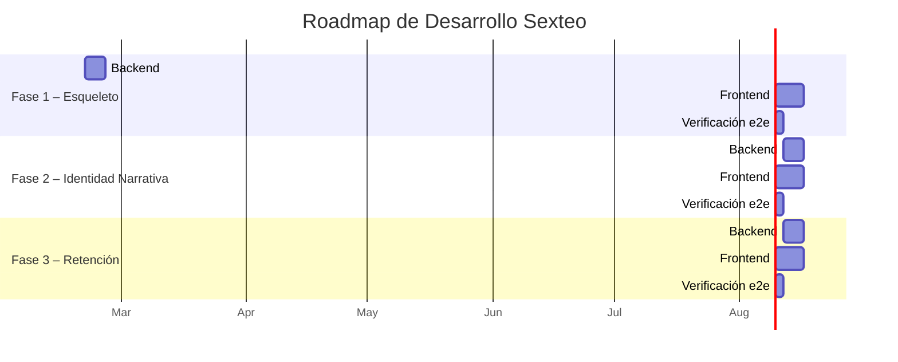
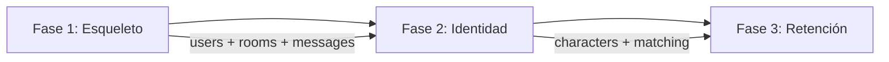

# 🗺️ Development Roadmap — Sexteo Platform

> **Estrategia**: Desarrollo vertical por fases (backend + frontend juntos por feature)  
> **Stack**: SvelteKit + Appwrite Cloud → Self-hosted  
> **Último update**: 2026-02-20

---

## Visión General

---

## Fase 1 — Esqueleto Funcional

> **Objetivo**: Un usuario puede registrarse, completar onboarding, y tener un chat 1-1 básico funcionando.

### Backend
| Componente | Colecciones | Estado |
|-----------|-------------|--------|
| Auth & Users | `users` (schema actualizado) | 🔄 Migrar |
| Chat | `rooms`, `messages` | 🆕 Crear |
| Seguridad | `reports` | 🆕 Crear |
| Onboarding | `onboarding_progress` (actualizado) | 🔄 Migrar |
| Storage | Bucket `avatars` | ✅ Existe |

### Frontend
| Pantalla | Ruta | Estado |
|---------|------|--------|
| Landing | `/` | ✅ Existe |
| Welcome | `/welcome` | ✅ Existe |
| Intent selection | `/intent` | ✅ Existe |
| Registro/Login | `/auth` | 🆕 Crear |
| Perfil de usuario | `/profile` | 🆕 Crear |
| Explorador de salas | `/explore` | 🔄 Refactorizar |
| Chat 1-1 | `/chat/[roomId]` | 🆕 Crear |
| Reportar usuario | modal | 🆕 Crear |

### Entregable
> Un flujo completo: landing → registro → perfil → encontrar sala → chatear en tiempo real

---

## Fase 2 — Identidad Narrativa

> **Objetivo**: Personajes, matching psicológico, y sistema de consentimiento.

### Backend
| Componente | Colecciones | Estado |
|-----------|-------------|--------|
| Personajes | `characters` (actualizado) | 🔄 Migrar |
| Perfil narrativo | `narrative_profiles` | 🆕 Crear |
| Límites | `limits_config` | 🆕 Crear |
| Matching | `matches` | 🆕 Crear |
| Typing | `typing_status` | 🆕 Crear |

### Frontend
| Pantalla | Ruta | Estado |
|---------|------|--------|
| Crear personaje | `/create/identity` | 🔄 Refactorizar |
| Personalidad | `/create/personality` | 🔄 Refactorizar |
| Configurar límites | `/settings/limits` | 🆕 Crear |
| Buscar match | `/match` | 🆕 Crear |
| Panel de compatibilidad | modal pre-chat | 🆕 Crear |
| Selector de personaje | componente | 🆕 Crear |
| Typing indicator | componente chat | 🆕 Crear |

### Entregable
> Match por compatibilidad narrativa → aceptar → panel de consentimiento → chatear como personaje

---

## Fase 3 — Retención y Monetización

> **Objetivo**: Gamificación, feedback, notificaciones, y planes premium.

### Backend
| Componente | Colecciones | Estado |
|-----------|-------------|--------|
| Reputación | `reputation_scores` | 🆕 Crear |
| Feedback | `story_feedback` | 🆕 Crear |
| Notificaciones | `notifications` | 🆕 Crear |
| Suscripciones | `subscriptions` | 🆕 Crear |
| Analytics | `analytics_events` | 🆕 Crear |

### Frontend
| Pantalla | Ruta | Estado |
|---------|------|--------|
| Feedback post-historia | modal | 🆕 Crear |
| Perfil con reputación | `/profile` | 🔄 Actualizar |
| Centro de notificaciones | `/notifications` | 🆕 Crear |
| Planes y pricing | `/premium` | 🆕 Crear |
| Dashboard admin | `/admin` | 🆕 Crear |

### Entregable
> Flujo completo: historia → feedback → reputación visible → notificaciones → upgrade premium

---

## Dependencias entre Fases

> [!IMPORTANT]
> Cada fase es un incremento funcional. Se puede lanzar el MVP con solo Fase 1 + Fase 2 completadas. Fase 3 puede implementarse post-lanzamiento.

---

## Riesgos y Consideraciones

| Riesgo | Fase | Mitigación |
|--------|------|-----------|
| Límite de colecciones Cloud Free | Fase 2 | Priorizar colecciones, fusionar si es necesario |
| Complejidad del matching | Fase 2 | MVP con matching simple por tags, IA post-MVP |
| Real-time a escala | Fase 1 | Appwrite Realtime tiene límites, monitorear |
| Verificación +18 legal | Fase 1 | Solo checkbox en MVP, servicio real post-lanzamiento |
| Moderación de contenido | Fase 1 | Reports manuales en MVP, IA moderadora post-MVP |
