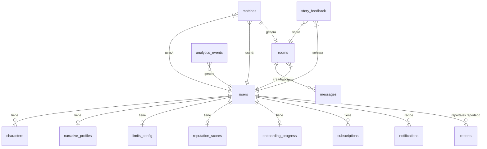

# 🗄️ Database Schema — Sexteo Platform

> **Backend**: Appwrite Cloud (migración futura a self-hosted)
> **Database ID**: `sexteo_main`

---

## Resumen de Colecciones

| # | Collection ID | Propósito | Fase MVP |
|---|--------------|-----------|----------|
| 1 | `users` | Perfil de usuario y estado global | Fase 1 |
| 2 | `characters` | Personajes narrativos del usuario | Fase 2 |
| 3 | `narrative_profiles` | DNA narrativo para matching | Fase 2 |
| 4 | `limits_config` | Límites y consentimiento | Fase 2 |
| 5 | `rooms` | Salas de chat (1-1 y grupales) | Fase 1 |
| 6 | `messages` | Mensajes de chat en tiempo real | Fase 1 |
| 7 | `matches` | Historial y estado de matches | Fase 2 |
| 8 | `reputation_scores` | Scoring y reputación | Fase 3 |
| 9 | `story_feedback` | Feedback post-historia | Fase 3 |
| 10 | `reports` | Reportes de usuarios | Fase 1 |
| 11 | `notifications` | Sistema de notificaciones | Fase 3 |
| 12 | `onboarding_progress` | Progreso del onboarding | Fase 1 |
| 13 | `subscriptions` | Planes premium y monetización | Fase 3 |
| 14 | `analytics_events` | Eventos para métricas internas | Fase 3 |

---

## 1. `users` — Perfil Principal

```
userId            string(36)    PK (= Appwrite Auth $id)
displayName       string(100)   Nombre público
email             email         Email (unique)
bio               string(500)   Bio narrativa
avatarFileId      string(50)    Referencia al archivo en Storage
age               integer       Edad (verificada +18)
gender            string(20)    Género declarado
globalState       string(30)    Estado global: VISITOR | REGISTERED | ACTIVE_INITIAL | IN_STORY | EXPLORING | EMOTIONAL_PAUSE | AT_RISK | BLOCKED
monetizationTier  string(20)    FREE | PREMIUM | CREATOR_PRO | NARRATOR_AI_PLUS
engagementLevel   string(20)    NEW | EXPLORER | INVOLVED | CORE_USER | AMBASSADOR
storiesCompleted  integer       Contador de historias finalizadas
isVerified        boolean       Verificación +18 completada
isOnline          boolean       Estado de conexión actual
lastActiveAt      datetime      Última actividad
createdAt         datetime      Fecha de registro
```

**Índices:**
- `idx_email` → unique(email)
- `idx_globalState` → key(globalState)
- `idx_lastActive` → key(lastActiveAt)
- `idx_monetization` → key(monetizationTier)

---

## 2. `characters` — Personajes Narrativos

```
characterId       string(36)    PK (auto-generated)
userId            string(36)    FK → users
name              string(100)   Nombre del personaje
description       string(1000)  Descripción y backstory
avatarFileId      string(50)    Avatar del personaje en Storage
personality       string(200)   Personalidad del personaje
narrativeStyle    string(50)    poético | directo | descriptivo | minimalista
desiredPlots      string(200)   Deseos de trama (JSON array serialized)
limits            string(500)   Límites específicos del personaje
narrativeGender   string(50)    Género narrativo preferido
traits            string(100)[] Array de rasgos
isActive          boolean       ¿Es el personaje seleccionado?
createdAt         datetime      Fecha de creación
```

**Índices:**
- `idx_userId` → key(userId)
- `idx_active` → key(userId, isActive)

---

## 3. `narrative_profiles` — DNA Narrativo (Para Matching)

```
profileId         string(36)    PK
userId            string(36)    FK → users (unique)

// Perfil de Deseo Narrativo (PDN)
dominantStyle     string(30)    romántico | oscuro | lúdico | intenso
preferredPace     string(20)    lento | progresivo | directo
initiativeLevel   string(20)    lidera | responde | alterna
tensionType       string(30)    emocional | psicológica | misterio

// Perfil de Energía Interactiva (PEI)
avgResponseTime   integer       Tiempo promedio de respuesta (segundos)
avgMessageLength  integer       Longitud promedio de mensaje
narrativeVsDialog float         Ratio narración/diálogo (0.0–1.0)
descriptiveAbility float        Capacidad descriptiva (0.0–1.0)

// Arquetipo Psicológico Narrativo (APN)
primaryArchetype  string(50)    Arquetipo dominante
secondaryArchetype string(50)   Arquetipo secundario
archetypeWeights  string(500)   JSON: pesos de cada arquetipo

// Preferencias de categorías/mundos
preferredWorlds   string(200)[] Array de mundos preferidos
intensityPreference integer     1–5 escala de intensidad

// Meta
isFromOnboarding  boolean       ¿Generado por onboarding?
lastUpdatedAt     datetime      Última actualización
createdAt         datetime      Fecha de creación
```

**Índices:**
- `idx_userId` → unique(userId)
- `idx_style_pace` → key(dominantStyle, preferredPace)

---

## 4. `limits_config` — Configuración de Límites y Consentimiento

```
configId          string(36)    PK
userId            string(36)    FK → users (unique)
excludedTopics    string(100)[] Temas excluidos
maxIntensity      integer       1–5
allowedLanguage   string(30)    suave | moderado | explícito
improvisationLevel string(20)  bajo | medio | alto
safeWord          string(50)    Palabra segura personalizada
allowGroupRooms   boolean       Permite salas grupales
maxGroupSize      integer       Tamaño máximo de grupo permitido
updatedAt         datetime      Última actualización
```

**Índices:**
- `idx_userId` → unique(userId)

---

## 5. `rooms` — Salas de Chat

```
roomId            string(36)    PK
type              string(10)    PRIVATE | GROUP
title             string(200)   Título de la historia/sala
genre             string(50)    Género narrativo
worldCategory     string(50)    Categoría de mundo
intensity         integer       1–5 intensidad acordada
status            string(20)    WAITING | ACTIVE | PAUSED | FINISHED | ABANDONED
participantIds    string(36)[]  Array de userId participantes
maxParticipants   integer       Máximo participantes (2 para 1-1, hasta 5 para grupo)
creatorId         string(36)    FK → users (quién creó la sala)
narrativeContext  string(2000)  Contexto narrativo / premisa
messageCount      integer       Contador de mensajes
lastMessageAt     datetime      Último mensaje
startedAt         datetime      Inicio de la historia
finishedAt        datetime      Fin de la historia
createdAt         datetime      Fecha de creación
```

**Índices:**
- `idx_status` → key(status)
- `idx_genre` → key(genre)
- `idx_creator` → key(creatorId)
- `idx_participants` → key(participantIds) — nota: limitado en Appwrite para arrays

---

## 6. `messages` — Mensajes de Chat

```
messageId         string(36)    PK
roomId            string(36)    FK → rooms
senderId          string(36)    FK → users
characterId       string(36)    FK → characters (personaje que envía)
content           string(5000)  Contenido del mensaje
messageType       string(20)    ACTION | DIALOGUE | NARRATION | SYSTEM | AI_EVENT
isNarratorAI      boolean       ¿Generado por IA narradora?
mediaFileId       string(50)    Archivo adjunto (opcional)
createdAt         datetime      Timestamp
```

**Índices:**
- `idx_roomId` → key(roomId)
- `idx_sender` → key(senderId)
- `idx_room_time` → key(roomId, createdAt)

---

## 7. `matches` — Sistema de Matching

```
matchId           string(36)    PK
userIdA           string(36)    FK → users
userIdB           string(36)    FK → users
characterIdA      string(36)    FK → characters (personaje de A)
characterIdB      string(36)    FK → characters (personaje de B)
matchScore        float         Score total (0–100)
desireScore       float         Componente deseo (0–100)
archetypeScore    float         Componente arquetipo (0–100)
rhythmScore       float         Componente ritmo (0–100)
experienceScore   float         Componente experiencia previa (0–100)
matchType         string(20)    SPARK | SLOW_BURN | CHAOS | MIRROR | OPPOSITES
chemistryLabel    string(30)    Neutral→Destino Narrativo
status            string(20)    PENDING | ACCEPTED | REJECTED | EXPIRED
roomId            string(36)    FK → rooms (si se acepta)
createdAt         datetime      Fecha de matching
respondedAt       datetime      Fecha de respuesta
```

**Índices:**
- `idx_userA` → key(userIdA)
- `idx_userB` → key(userIdB)
- `idx_status` → key(status)
- `idx_score` → key(matchScore)

---

## 8. `reputation_scores` — Sistema de Reputación

```
scoreId           string(36)    PK
userId            string(36)    FK → users (unique)

// 4 métricas principales
consentScore      float         CS: Consent Score (0–100)
narrativeQuality  float         NQS: Narrative Quality Score (0–100)
emotionalStability float        ESI: Emotional Stability Index (0–100)
communityTrust    float         CTL: Community Trust Level (0–100)

// Índice compuesto
reputationIndex   float         RI: (0.35×CS + 0.30×NQS + 0.20×CTL + 0.15×ESI)
publicLevel       string(30)    Explorador | Narrador | Conector | Maestro | Arquitecto

// Contadores para cálculo
totalReports      integer       Reportes totales recibidos
totalPauses       integer       Pausas emocionales activadas
totalStoriesCompleted integer   Historias finalizadas
totalAbandons     integer       Abandonos
avgRating         float         Calificación promedio recibida

updatedAt         datetime      Última actualización
createdAt         datetime      Fecha de creación
```

**Índices:**
- `idx_userId` → unique(userId)
- `idx_reputation` → key(reputationIndex)
- `idx_level` → key(publicLevel)

---

## 9. `story_feedback` — Feedback Post-Historia

```
feedbackId        string(36)    PK
roomId            string(36)    FK → rooms
fromUserId        string(36)    FK → users (quien califica)
toUserId          string(36)    FK → users (quien es calificado)
respectLimits     boolean       ¿Respetó tus límites?
coherentExperience boolean      ¿La experiencia fue coherente?
wouldRepeat       boolean       ¿Te gustaría repetir?
creativityScore   integer       1–5
respectScore      integer       1–5
narrativeScore    integer       1–5
comment           string(500)   Comentario opcional
createdAt         datetime      Fecha del feedback
```

**Índices:**
- `idx_roomId` → key(roomId)
- `idx_toUser` → key(toUserId)

---

## 10. `reports` — Reportes de Usuarios

```
reportId          string(36)    PK
reporterId        string(36)    FK → users (quien reporta)
reportedId        string(36)    FK → users (reportado)
roomId            string(36)    FK → rooms (contexto)
reason            string(50)    HARASSMENT | LIMIT_VIOLATION | SPAM | INAPPROPRIATE | OTHER
description       string(1000)  Descripción detallada
status            string(20)    OPEN | REVIEWING | RESOLVED | DISMISSED
adminNotes        string(1000)  Notas del moderador
resolvedAt        datetime      Fecha de resolución
createdAt         datetime      Fecha del reporte
```

**Índices:**
- `idx_reported` → key(reportedId)
- `idx_status` → key(status)
- `idx_created` → key(createdAt)

---

## 11. `notifications` — Sistema de Notificaciones

```
notificationId    string(36)    PK
userId            string(36)    FK → users (destinatario)
type              string(30)    MATCH_FOUND | STORY_INVITE | MESSAGE_RECEIVED | REQUEST_ACCEPTED | SYSTEM | REPUTATION_CHANGE
title             string(200)   Título
body              string(500)   Cuerpo
referenceId       string(36)    ID de referencia (roomId, matchId, etc.)
referenceType     string(20)    ROOM | MATCH | USER | SYSTEM
isRead            boolean       ¿Leída?
createdAt         datetime      Fecha de creación
```

**Índices:**
- `idx_userId` → key(userId)
- `idx_userId_read` → key(userId, isRead)
- `idx_type` → key(type)

---

## 12. `onboarding_progress` — Progreso del Onboarding

```
progressId        string(36)    PK
userId            string(36)    FK → users (unique)
currentFlow       string(20)    Flujo actual
currentStep       string(50)    Paso actual
userData          string(5000)  JSON con datos capturados
narrativeTestDone boolean       ¿Completó el test narrativo?
characterCreated  boolean       ¿Creó al menos 1 personaje?
limitsConfigured  boolean       ¿Configuró límites?
demoStoryDone     boolean       ¿Completó historia demo?
completedAt       datetime      Fecha de finalización
createdAt         datetime      Fecha de inicio
```

**Índices:**
- `idx_userId` → unique(userId)

---

## 13. `subscriptions` — Monetización

```
subscriptionId    string(36)    PK
userId            string(36)    FK → users
plan              string(30)    FREE | PREMIUM | CREATOR_PRO | NARRATOR_AI_PLUS
status            string(20)    ACTIVE | CANCELLED | EXPIRED | TRIAL
characterSlots    integer       Slots de personajes disponibles
priorityMatching  boolean       Matching prioritario habilitado
exclusiveRooms    boolean       Acceso a salas exclusivas
aiNarratorAccess  boolean       Acceso a IA narradora avanzada
startedAt         datetime      Inicio de suscripción
expiresAt         datetime      Expiración
cancelledAt       datetime      Fecha de cancelación
createdAt         datetime      Fecha de creación
```

**Índices:**
- `idx_userId` → key(userId)
- `idx_status` → key(status)
- `idx_plan` → key(plan)

---

## 14. `analytics_events` — Eventos de Analytics

```
eventId           string(36)    PK
userId            string(36)    FK → users (opcional)
eventType         string(50)    STORY_STARTED | STORY_FINISHED | STORY_ABANDONED | MATCH_CREATED | MATCH_ACCEPTED | PAUSE_ACTIVATED | REPORT_FILED | SUBSCRIPTION_STARTED
metadata          string(2000)  JSON con datos del evento
roomId            string(36)    FK → rooms (si aplica)
createdAt         datetime      Timestamp del evento
```

**Índices:**
- `idx_type` → key(eventType)
- `idx_user` → key(userId)
- `idx_created` → key(createdAt)

---

## Diagrama de Relaciones



---

## Notas de Implementación

> [!WARNING]
> **Limitación Appwrite Cloud Free Plan**: Solo permite 1 database y número limitado de colecciones. Para el MVP inicial, priorizar colecciones de Fase 1 y 2. Las de Fase 3 se agregarán al migrar a self-hosted.

> [!IMPORTANT]
> **Arrays en Appwrite**: Los atributos `array: true` tienen limitaciones en queries. Para búsquedas complejas (como `participantIds` en rooms), considerar desnormalizar con una colección `room_participants` intermedia.

> [!NOTE]
> **Tipos `float`**: Appwrite usa `createFloatAttribute()` para decimales. Los scores de matching y reputación usan este tipo.
