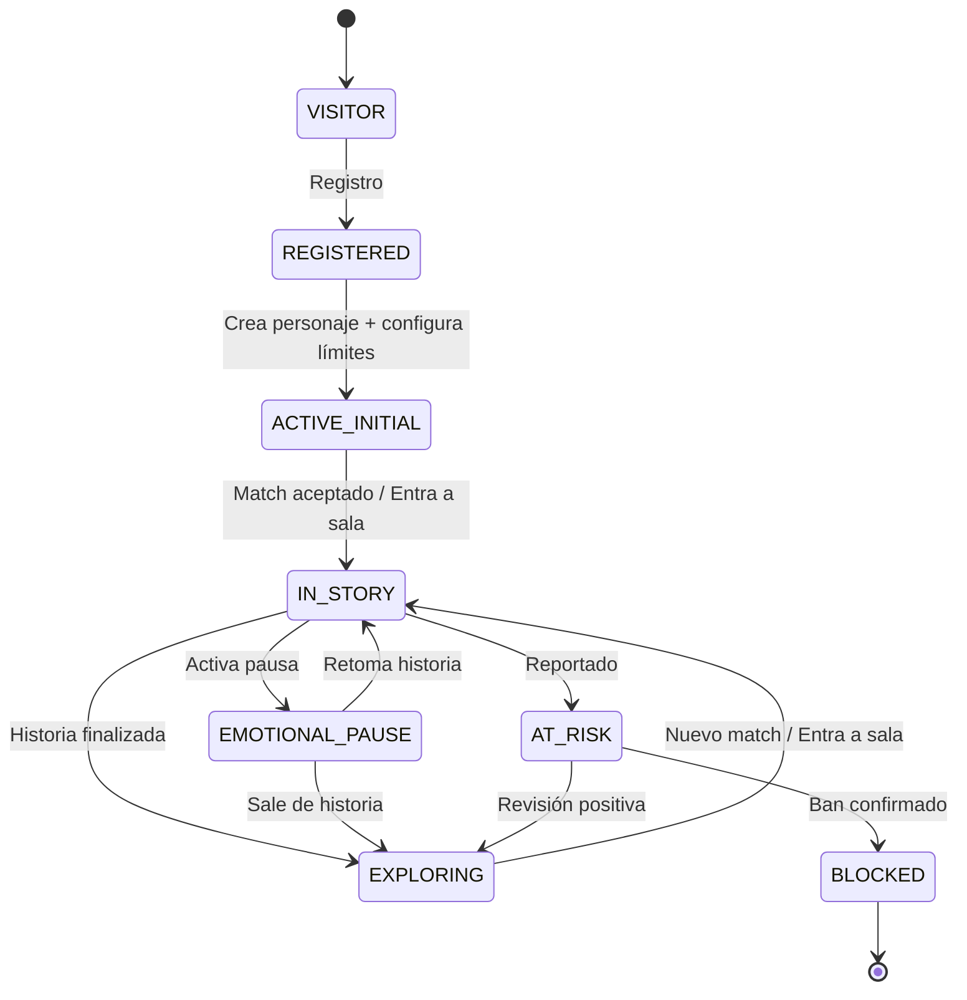
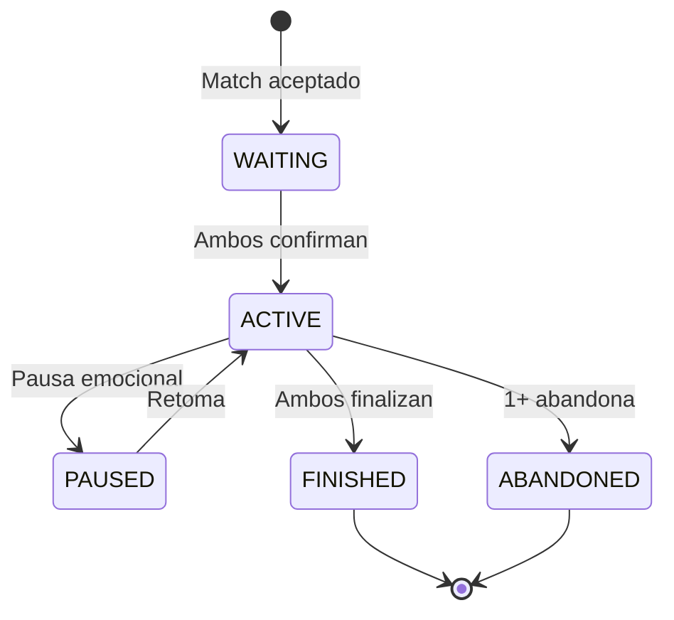

# ⚖️ Reglas de Negocio — Sexteo Platform

> Documento de referencia para implementar la lógica de negocio del backend.

---

## 1. Gestión de Usuarios

### 1.1 Registro y Verificación
- Todo usuario **debe ser +18** para registrarse
- El registro crea un usuario en estado `REGISTERED`
- Email debe ser **único** en la plataforma
- La sesión anónima de Appwrite se usa durante el onboarding; al completar registro, se convierte en cuenta permanente

### 1.2 Máquina de Estados del Usuario



### 1.3 Reglas de Transición de Estado

| De → A | Condición | Acción del Sistema |
|--------|-----------|-------------------|
| VISITOR → REGISTERED | Email + password + acepta TOS | Crear usuario + onboarding_progress |
| REGISTERED → ACTIVE_INITIAL | ≥1 personaje + límites configurados + onboarding completo | Habilitar matching |
| ACTIVE_INITIAL → IN_STORY | Match aceptado por ambas partes | Crear room + notificar |
| IN_STORY → EMOTIONAL_PAUSE | Botón de pausa | Notificar contraparte, pausar room |
| IN_STORY → EXPLORING | Ambos finalizan historia | Activar feedback, guardar room |
| * → AT_RISK | CS < 60 OR 3+ reportes en 7 días | Reducir visibilidad, marcar revisión |
| AT_RISK → BLOCKED | Admin confirma ban | Desactivar cuenta, cerrar rooms activas |

### 1.4 Niveles de Engagement (Interno)

| Nivel | Condición | Acciones del Sistema |
|-------|-----------|---------------------|
| NEW | 0–1 historias | Tutorial y guía activa |
| EXPLORER | 2–5 historias | Sugerencias de mundos |
| INVOLVED | 6–20 historias | Ofertas premium |
| CORE_USER | 20+ historias | Acceso a eventos especiales |
| AMBASSADOR | Invita usuarios activos | Recompensas y beneficios |

---

## 2. Personajes

### 2.1 Reglas de Creación
- Un usuario FREE puede tener **máximo 3 personajes**
- PREMIUM puede tener **hasta 10 personajes**
- CREATOR_PRO: **ilimitados**
- Solo **1 personaje puede estar activo** a la vez
- Al crear el primer personaje, transición de estado REGISTERED → ACTIVE_INITIAL

### 2.2 Campos Obligatorios
- `name` (mínimo 2 caracteres)
- `personality` (mínimo 10 caracteres)
- `narrativeStyle` (selección de lista)

### 2.3 Personaje Activo
- El personaje activo define la identidad en matching y chat
- Se puede cambiar personaje activo solo si **no está en historia activa**
- Si se elimina el personaje activo, se debe seleccionar otro antes de poder hacer match

---

## 3. Sistema de Consentimiento y Límites

### 3.1 Configuración Obligatoria
- Antes de poder acceder a matching, el usuario **debe configurar límites**
- Campos requeridos: `maxIntensity`, `allowedLanguage`

### 3.2 Panel de Compatibilidad Pre-Chat
Antes de iniciar una historia, se muestra un panel con:
- Intensidad narrativa acordada (mínimo de ambos)
- Temas permitidos (intersección)
- Temas prohibidos (unión de ambos)
- Ritmo narrativo (promedio)

Ambos usuarios deben hacer click en **"Aceptar dinámica"** para comenzar.

### 3.3 Safe Word
- Si un usuario activa palabra segura → la historia se **pausa inmediatamente**
- Se envía notificación a contraparte
- Se reduce intensidad narrativa del room

### 3.4 Incompatibilidad de Límites
- Si `PL(A) ∩ Deseos(B) = conflicto` → **no se permite el match**
- Esto actúa como **filtro duro** antes de calcular score

---

## 4. Matching

### 4.1 Flujo de Matching

```
1. Usuario solicita match → "Buscar historia"
2. Sistema filtra por límites (hard filter)
3. Calcula MatchScore con usuarios disponibles
4. Presenta match al usuario
5. Opciones: Aceptar / Rechazar
6. Si ambos aceptan → Crear room + notificar
```

### 4.2 Fórmula de MatchScore

```
MatchScore = (0.35 × DesireScore) + 
             (0.30 × ArchetypeScore) + 
             (0.20 × RhythmScore) + 
             (0.15 × ExperienceScore)
```

### 4.3 Tipos de Match

| Tipo | Score Range | Descripción |
|------|------------|-------------|
| 🔥 Match Fuerte | 80–100% | Alta compatibilidad narrativa |
| 🌙 Match Exploratorio | 60–79% | Puede funcionar con ajuste |
| 🎭 Match Experimental | 40–59% | Solo si usuario elige explorar |

### 4.4 Labels de Química (UX)

| Score | Label Público |
|-------|--------------|
| 0–20 | Neutral |
| 21–40 | Intriga |
| 41–60 | Conexión |
| 61–80 | Tensión |
| 81–90 | Alquimia |
| 91–100 | Destino Narrativo |

### 4.5 Matching Dinámico
- El sistema ajusta perfiles basándose en comportamiento real vs declarado
- Historias exitosas (> 30 min + finalización formal + feedback positivo) mejoran el modelo
- Abandonos tempranos penalizan el matching

### 4.6 Prioridad Premium
- Usuarios PREMIUM aparecen primero en la cola de matching
- PREMIUM ve más matches simultáneos (5 vs 2 para FREE)

---

## 5. Rooms y Chat

### 5.1 Tipos de Salas

| Tipo | Max Participantes | Disponibilidad |
|------|------------------|----------------|
| PRIVATE | 2 | Fase 1 MVP |
| GROUP | 5 | Fase 3 |

### 5.2 Estados de la Sala



### 5.3 Reglas de Chat
- Los mensajes se clasifican en: ACTION, DIALOGUE, NARRATION, SYSTEM, AI_EVENT
- Formato de acción: texto entre `*asteriscos*`
- Formato de diálogo: texto con `—guión` inicial o directo
- Máximo 5000 caracteres por mensaje
- Indicador de "escribiendo" en tiempo real

### 5.4 IA Narradora (Opcional)
- La IA puede intervenir como: narrador maestro, NPC, generador de giros, moderador de tono
- Solo disponible en plan PREMIUM+
- Si la conversación decae (sin mensajes > 5 min), la IA puede sugerir un giro

### 5.5 Finalización de Historia
- Cualquier participante puede proponer finalizar
- Requiere **confirmación de ambos** para marcar como FINISHED
- Si solo uno abandona → estado ABANDONED
- Tanto FINISHED como ABANDONED activan el flujo de feedback

---

## 6. Reputación y Scoring

### 6.1 Las 4 Métricas

```
Reputation Index (RI) = 
  (0.35 × ConsentScore) + 
  (0.30 × NarrativeQuality) + 
  (0.20 × CommunityTrust) + 
  (0.15 × EmotionalStability)
```

### 6.2 Cálculo del Consent Score (CS)
- Base: 80/100
- +5 por cada historia sin reportes (máx +20)
- -10 por cada reporte confirmado
- -5 por cada abandono abrupto
- -3 por cada pausa no recíproca

### 6.3 Cálculo del Narrative Quality (NQS)
- Basado en feedback post-historia
- Promedio ponderado de: creatividad × 0.4 + respeto × 0.3 + coherencia × 0.3
- Mínimo 3 feedbacks para generar score

### 6.4 Niveles Públicos

| RI | Nivel | Badge |
|----|-------|-------|
| 0–30 | Explorador | 🌑 |
| 31–50 | Narrador | 🌒 |
| 51–70 | Conector | 🌓 |
| 71–85 | Maestro | 🌔 |
| 86–100 | Arquitecto de Historias | 🌕 |

### 6.5 Sistema Anti-Tóxico
Triggers automáticos:
- CS < 60 → shadow visibility (matching reducido)
- 3 reportes en 7 días → revisión manual obligatoria
- NQS cae > 20 puntos en 1 semana → alerta admin
- Acciones: shadow ban, restricción temporal, reentrenamiento (mini tutorial)

---

## 7. Notificaciones

### 7.1 Eventos que Disparan Notificaciones

| Evento | Tipo | Destinatario |
|--------|------|-------------|
| Match encontrado | MATCH_FOUND | Ambos usuarios |
| Invitación a historia | STORY_INVITE | Invitado |
| Mensaje recibido | MESSAGE_RECEIVED | Otro participante |
| Solicitud aceptada | REQUEST_ACCEPTED | Solicitante |
| Pausa emocional | SYSTEM | Contraparte |
| Cambio de reputación | REPUTATION_CHANGE | Usuario afectado |

---

## 8. Monetización

### 8.1 Planes

| Feature | FREE | PREMIUM | CREATOR_PRO |
|---------|------|---------|-------------|
| Personajes | 3 | 10 | ∞ |
| Matches simultáneos | 2 | 5 | 10 |
| Salas grupales | ❌ | ✅ | ✅ |
| IA Narradora | ❌ | Básica | Avanzada |
| Matching prioritario | ❌ | ✅ | ✅ |
| Eventos exclusivos | ❌ | ❌ | ✅ |
| Monetización como creador | ❌ | ❌ | ✅ |

### 8.2 Triggers de Upsell
- Al intentar crear 4° personaje (FREE) → mostrar PREMIUM
- Al recibir match tipo "Destino Narrativo" → sugerir PREMIUM para prioridad
- Después de 5 historias exitosas → ofrecer CREATOR_PRO

---

## 9. Seguridad y Control

### 9.1 Acciones Disponibles por Usuario
- **Salir inmediato**: termina historia sin finalización formal
- **Bloquear usuario**: impide matching futuro
- **Reportar usuario**: envía reporte para revisión
- **Silenciar usuario**: deja de recibir notificaciones
- **Finalizar historia**: propone finalización consensuada

### 9.2 Panel de Moderación (Admin)
- Ver reportes abiertos
- Suspender cuentas temporalmente
- Ban permanente
- Acceder a logs de chat reportados
- Ver métricas de plataforma
