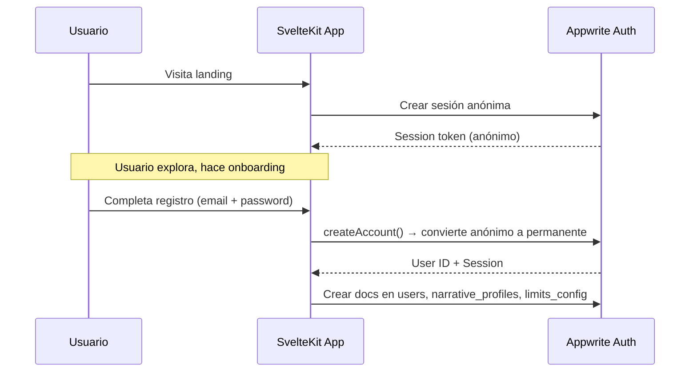

# 🔐 Auth & Security Plan — Sexteo Platform

> **Backend**: Appwrite Auth
> **Framework**: SvelteKit (client-side SDK)

---

## 1. Flujo de Autenticación

### 1.1 Onboarding → Registro



### 1.2 Login
```
1. Email + Password → account.createEmailPasswordSession()
2. Redirigir a /explore o /onboarding según estado del usuario
3. Session persiste con cookie httpOnly (gestionado por Appwrite SDK)
```

### 1.3 Logout
```
1. account.deleteSession('current')
2. Limpiar stores locales
3. Redirigir a landing
```

### 1.4 Recuperación de Contraseña
```
1. account.createRecovery(email, redirectUrl)
2. Appwrite envía email con link
3. Usuario hace click → llega a /verify?token=xxx
4. account.updateRecovery(userId, secret, password)
```

---

## 2. Verificación +18

### 2.1 Flujo MVP (Simple)
- Checkbox "Confirmo que soy mayor de 18 años" durante registro
- Se almacena `isVerified: true` + fecha de nacimiento declarada
- **No hay verificación real de edad en MVP** (legal: términos de servicio)

### 2.2 Flujo Futuro (Robusto)
- Integración con servicio de verificación de identidad (Jumio, Onfido)
- Verificación por documento de identidad + selfie
- Se almacena hash del proceso (no el documento)

---

## 3. Permisos por Colección (Appwrite)

### 3.1 Modelo de Permisos

| Colección | Read | Create | Update | Delete |
|-----------|------|--------|--------|--------|
| `users` | any() | users() | users()* | — |
| `characters` | any() | users() | users()* | users()* |
| `narrative_profiles` | users()* | users() | users()* | — |
| `limits_config` | users()* | users() | users()* | — |
| `rooms` | users()† | users() | users()† | — |
| `messages` | users()† | users() | — | — |
| `matches` | users()* | server | users()* | — |
| `reputation_scores` | any() (público) | server | server | — |
| `story_feedback` | server | users() | — | — |
| `reports` | server | users() | server | — |
| `notifications` | users()* | server | users()* | — |
| `onboarding_progress` | users()* | users() | users()* | — |
| `subscriptions` | users()* | server | server | — |
| `analytics_events` | server | users() / server | — | — |

> `*` = solo su propio documento (document-level permissions)  
> `†` = solo participantes del room  
> `server` = solo via API key (Appwrite Functions o scripts admin)

### 3.2 Document-Level Permissions
Appwrite permite permisos a nivel de documento cuando se habilita `documentSecurity: true` en la colección:

```javascript
// Al crear un documento de usuario, añadir permisos individuales:
Permission.read(Role.user(userId)),
Permission.update(Role.user(userId)),
```

---

## 4. Seguridad de Datos

### 4.1 Datos Sensibles
- **Contraseñas**: gestionadas por Appwrite Auth (hashed con Argon2)
- **API Key**: solo en `.env` del servidor, nunca en el cliente
- **Sesiones**: gestionadas por Appwrite con tokens seguros
- **Logs de chat**: almacenados con cifrado en reposo (Appwrite default)

### 4.2 Validación de Entrada

| Campo | Validación |
|-------|-----------|
| email | Formato email válido |
| displayName | 2–100 chars, sin caracteres especiales peligrosos |
| bio | Max 500 chars, sanitizar HTML |
| message content | Max 5000 chars, sanitizar HTML/scripts |
| safeWord | Max 50 chars |
| description (report) | Max 1000 chars |

### 4.3 Rate Limiting
- Appwrite incluye rate limiting por defecto
- Adicional a implementar:
  - Matching: máximo 10 solicitudes por hora (FREE), 30 (PREMIUM)
  - Mensajes: máximo 60 por minuto por usuario
  - Reportes: máximo 5 por día por usuario

---

## 5. Roles del Sistema

### 5.1 Tipos de Rol

| Rol | Descripción | Acceso |
|-----|-------------|--------|
| `anonymous` | Sesión anónima pre-registro | Solo lectura de landing/prevew |
| `user` | Usuario registrado | CRUD de sus datos + chat |
| `premium` | Suscriptor premium | Funciones premium (label, no role real de AW) |
| `moderator` | Moderador humano | Ver reportes, suspender usuarios |
| `admin` | Administrador | Todo + dashboard analytics |

### 5.2 Implementación en Appwrite
- Appwrite Auth maneja `user` / `admin` nativamente
- `moderator` se implementa como **Appwrite Team** "moderators"
- `premium` / `creator_pro` se maneja via campo `monetizationTier` en la colección `users`

---

## 6. Protección de Rutas (SvelteKit)

### 6.1 Middleware de Auth

```javascript
// src/routes/+layout.js (o +layout.server.js)
export async function load() {
    // Verificar sesión activa
    // Si no hay sesión → redirigir a landing
    // Si hay sesión sin personaje → redirigir a onboarding
}
```

### 6.2 Rutas Protegidas

| Ruta | Requiere | Condición |
|------|----------|-----------|
| `/` | Ninguno | Landing pública |
| `/verify` | Ninguno | Recuperación de contraseña |
| `/welcome` | Sesión anónima | Onboarding |
| `/create` | Sesión anónima | Creación de cuenta |
| `/explore` | Auth + personaje | Dashboard principal |
| `/chat/*` | Auth + personaje | Chat narrativo |
| `/tutorial` | Auth | Tutorial |
| `/admin/*` | Auth + Team:admin | Dashboard admin |

---

## 7. CORS y Seguridad Web

### 7.1 Headers de Seguridad
```
Content-Security-Policy: default-src 'self'; connect-src https://sfo.cloud.appwrite.io
X-Frame-Options: DENY
X-Content-Type-Options: nosniff
Referrer-Policy: strict-origin-when-cross-origin
```

### 7.2 Appwrite Platform
- Configurar en Appwrite Console → Settings → Platforms:
  - Web: `localhost` (dev) + dominio de producción
  - Solo dominios permitidos pueden hacer requests al proyecto

---

## Notas de Implementación

> [!IMPORTANT]
> El `APPWRITE_API_KEY` del `.env` actual está expuesto en el repositorio. **Debe rotarse antes de producción** y nunca incluirse en el código cliente.

> [!WARNING]
> La verificación +18 por checkbox no es suficiente para todos los mercados. Investigar requisitos legales del país objetivo antes de lanzar.
