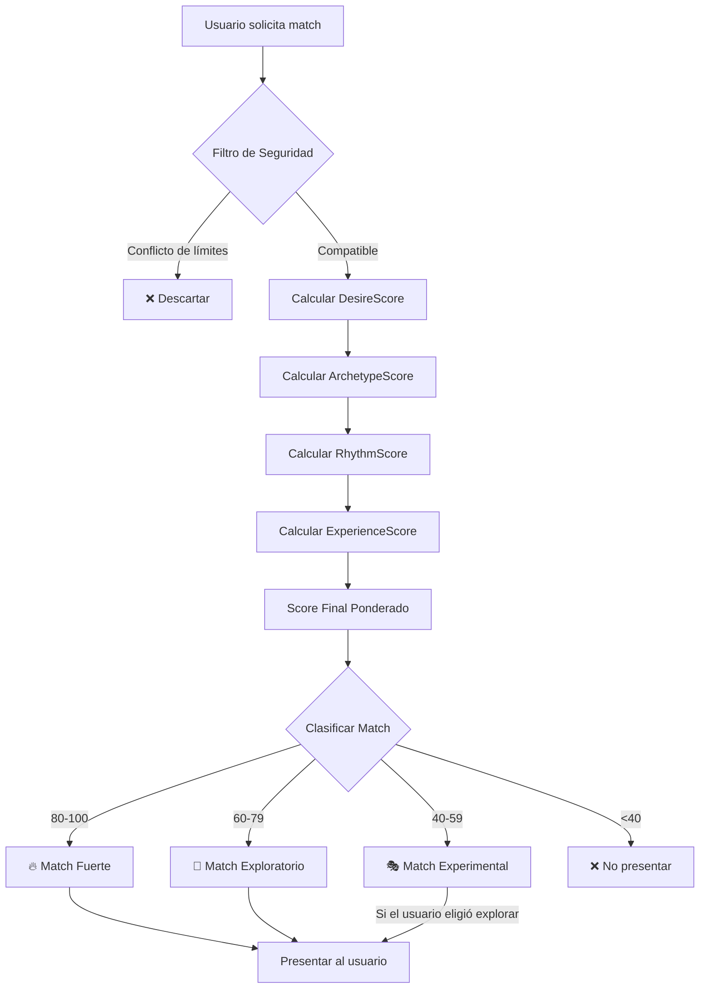

# 🧠 Matching Algorithm Plan — Sexteo Platform

> **Nombre interno**: NarrativeSync Engine
> **Fase MVP**: Matching básico por tags + límites (Fase 2)
> **Fase Avanzada**: ML conductual + análisis semántico (Post-MVP)

---

## 1. Arquitectura del Algoritmo



---

## 2. Vectores del Perfil Narrativo

Cada usuario se representa como:

```
U = { PDN, PL, PEI, APN }

PDN = Perfil de Deseo Narrativo
PL  = Perfil de Límites  
PEI = Perfil de Energía Interactiva
APN = Arquetipo Psicológico Narrativo
```

### 2.1 PDN — Perfil de Deseo Narrativo

| Campo | Valores Posibles | Tipo |
|-------|-----------------|------|
| `dominantStyle` | romántico, oscuro, lúdico, intenso | enum (string) |
| `preferredPace` | lento, progresivo, directo | enum (string) |
| `initiativeLevel` | lidera, responde, alterna | enum (string) |
| `tensionType` | emocional, psicológica, misterio | enum (string) |

### 2.2 PL — Perfil de Límites (Hard Filter)

| Campo | Función |
|-------|---------|
| `excludedTopics` | Array de temas vetados |
| `maxIntensity` | 1–5 |
| `allowedLanguage` | suave, moderado, explícito |
| `improvisationLevel` | bajo, medio, alto |

### 2.3 PEI — Perfil de Energía Interactiva

| Campo | Fuente | Cálculo |
|-------|--------|---------|
| `avgResponseTime` | Comportamiento real | Promedio últimas 20 historias |
| `avgMessageLength` | Comportamiento real | Promedio últimas 100 mensajes |
| `narrativeVsDialog` | Comportamiento real | Ratio ACTION+NARRATION / DIALOGUE |
| `descriptiveAbility` | Comportamiento real | Longitud promedio de acciones |

### 2.4 APN — Arquetipos Psicológicos Narrativos

| Arquetipo | Descripción | Compatibilidades |
|-----------|-------------|-----------------|
| Seductor Estratégico | Planifica cada interacción | + Provocadora Lúdica, + Mente Misteriosa |
| Mente Misteriosa | Genera intriga constante | + Seductor Estratégico, + Protector Intenso |
| Protector Intenso | Conexión emocional fuerte | + Mente Misteriosa, + Provocadora Lúdica |
| Provocadora Lúdica | Juega y desafía | + Seductor Estratégico, + Observador Dominante |
| Observador Dominante | Controla el ritmo | + Provocadora Lúdica |

---

## 3. Pasos del Algoritmo

### Paso 1: Filtro de Seguridad (Hard Filter)

```javascript
function securityFilter(userA, userB) {
    const limitsA = userA.limitsConfig;
    const limitsB = userB.limitsConfig;
    const profileA = userA.narrativeProfile;
    const profileB = userB.narrativeProfile;

    // Verificar que los deseos de A no violen límites de B y viceversa
    for (const topic of profileA.preferredWorlds) {
        if (limitsB.excludedTopics.includes(topic)) return false;
    }
    for (const topic of profileB.preferredWorlds) {
        if (limitsA.excludedTopics.includes(topic)) return false;
    }

    // Verificar compatibilidad de intensidad
    if (Math.abs(profileA.intensityPreference - limitsB.maxIntensity) > 2) return false;
    if (Math.abs(profileB.intensityPreference - limitsA.maxIntensity) > 2) return false;

    // Verificar compatibilidad de lenguaje
    const langLevels = { suave: 1, moderado: 2, explícito: 3 };
    if (langLevels[limitsA.allowedLanguage] < langLevels[limitsB.allowedLanguage] - 1) return false;

    return true;
}
```

### Paso 2: DesireScore (35% del total)

```javascript
function calculateDesireScore(profileA, profileB) {
    let score = 0;

    // Compatibilidad de estilo (similitud)
    if (profileA.dominantStyle === profileB.dominantStyle) score += 30;
    else if (isRelatedStyle(profileA.dominantStyle, profileB.dominantStyle)) score += 15;

    // Compatibilidad de ritmo (similitud)
    if (profileA.preferredPace === profileB.preferredPace) score += 30;
    else score += 10;

    // Complementariedad de iniciativa (polaridad preferida)
    if (profileA.initiativeLevel !== profileB.initiativeLevel) score += 25;
    else if (profileA.initiativeLevel === 'alterna') score += 20;
    else score += 5;

    // Tensión compatible
    if (profileA.tensionType === profileB.tensionType) score += 15;

    return Math.min(score, 100);
}
```

### Paso 3: ArchetypeScore (30% del total)

```javascript
// Matriz de compatibilidad de arquetipos
const ARCHETYPE_MATRIX = {
    'Seductor Estratégico': {
        'Provocadora Lúdica': 95,
        'Mente Misteriosa': 85,
        'Protector Intenso': 60,
        'Observador Dominante': 40,
        'Seductor Estratégico': 55,
    },
    // ... definir todas las combinaciones
};

function calculateArchetypeScore(profileA, profileB) {
    const primary = ARCHETYPE_MATRIX[profileA.primaryArchetype]?.[profileB.primaryArchetype] || 50;
    const secondary = ARCHETYPE_MATRIX[profileA.secondaryArchetype]?.[profileB.secondaryArchetype] || 50;
    return (primary * 0.7) + (secondary * 0.3);
}
```

### Paso 4: RhythmScore (20% del total)

```javascript
function calculateRhythmScore(peiA, peiB) {
    let score = 100;

    // Diferencia de frecuencia de respuesta
    const responseTimeDiff = Math.abs(peiA.avgResponseTime - peiB.avgResponseTime);
    if (responseTimeDiff > 120) score -= 30; // > 2 min diferencia
    else if (responseTimeDiff > 60) score -= 15;

    // Diferencia de longitud de mensaje
    const lengthDiff = Math.abs(peiA.avgMessageLength - peiB.avgMessageLength);
    if (lengthDiff > 500) score -= 20; // muy desbalanceado
    else if (lengthDiff > 200) score -= 10;

    // Compatibilidad narración vs diálogo
    const styleDiff = Math.abs(peiA.narrativeVsDialog - peiB.narrativeVsDialog);
    if (styleDiff > 0.5) score -= 15;

    return Math.max(score, 0);
}
```

### Paso 5: ExperienceScore (15% del total)

```javascript
function calculateExperienceScore(userA, userB) {
    let score = 50; // base

    // ¿Han tenido historias previas juntos?
    const previousMatches = getPreviousMatches(userA.id, userB.id);
    if (previousMatches.length > 0) {
        const avgFeedback = getAvgFeedback(previousMatches);
        if (avgFeedback > 4) score += 40; // excelente experiencia previa
        else if (avgFeedback > 3) score += 20;
        else if (avgFeedback < 2) score -= 30; // mala experiencia
    }

    // Nivel de engagement similar
    const engagementLevels = ['NEW', 'EXPLORER', 'INVOLVED', 'CORE_USER', 'AMBASSADOR'];
    const levelDiff = Math.abs(
        engagementLevels.indexOf(userA.engagementLevel) - 
        engagementLevels.indexOf(userB.engagementLevel)
    );
    if (levelDiff <= 1) score += 10;

    return Math.min(Math.max(score, 0), 100);
}
```

### Score Final

```javascript
function calculateMatchScore(userA, userB) {
    if (!securityFilter(userA, userB)) return null; // No match posible

    const desire = calculateDesireScore(userA.narrativeProfile, userB.narrativeProfile);
    const archetype = calculateArchetypeScore(userA.narrativeProfile, userB.narrativeProfile);
    const rhythm = calculateRhythmScore(userA.narrativeProfile, userB.narrativeProfile);
    const experience = calculateExperienceScore(userA, userB);

    const totalScore = 
        (0.35 * desire) + 
        (0.30 * archetype) + 
        (0.20 * rhythm) + 
        (0.15 * experience);

    return {
        totalScore,
        desireScore: desire,
        archetypeScore: archetype,
        rhythmScore: rhythm,
        experienceScore: experience,
        matchType: classifyMatch(totalScore, userA, userB),
        chemistryLabel: getChemistryLabel(totalScore),
    };
}
```

---

## 4. Clasificación de Match

```javascript
function classifyMatch(score, userA, userB) {
    if (score >= 80) {
        // Determinar subtipo
        const pA = userA.narrativeProfile;
        const pB = userB.narrativeProfile;
        if (pA.dominantStyle === pB.dominantStyle) return 'MIRROR';
        if (areOpposites(pA, pB)) return 'OPPOSITES';
        return 'SPARK';
    }
    if (score >= 60) return 'SLOW_BURN';
    if (score >= 40) return 'CHAOS';
    return null; // No presentar
}

function getChemistryLabel(score) {
    if (score >= 91) return 'Destino Narrativo';
    if (score >= 81) return 'Alquimia';
    if (score >= 61) return 'Tensión';
    if (score >= 41) return 'Conexión';
    if (score >= 21) return 'Intriga';
    return 'Neutral';
}
```

---

## 5. Matching Dinámico (Post-MVP)

El sistema aprende y ajusta perfiles basándose en:

| Señal | Efecto en Perfil |
|-------|-----------------|
| Historia > 30 min + finalización formal | Reforzar el estilo de ese match |
| Abandono < 5 min | Penalizar patrón de match |
| Pausa emocional frecuente | Reducir `maxIntensity` calculada |
| Feedback positivo repetido con mismo tipo | Aumentar peso del arquetipo |
| Re-match con mismo usuario | Confirmar compatibilidad real |

### Ajuste de Perfil

```javascript
function adjustProfile(userId, matchResult, metrics) {
    const profile = getNarrativeProfile(userId);
    const alpha = 0.1; // factor de aprendizaje

    // Si la historia fue exitosa, mover perfil hacia el match
    if (metrics.storyDuration > 1800 && metrics.feedback > 3.5) {
        profile.dominantStyle = blend(profile.dominantStyle, matchResult.partnerStyle, alpha);
        // ... ajustar otros campos
    }

    // Si hubo abandono, alejar del patrón
    if (metrics.storyDuration < 300 && !metrics.formalEnd) {
        profile.dominantStyle = moveAway(profile.dominantStyle, matchResult.partnerStyle, alpha);
    }

    updateNarrativeProfile(userId, profile);
}
```

---

## 6. Cola de Matching

### Implementación MVP

```javascript
async function findMatches(userId) {
    const user = await getUser(userId);
    const candidates = await getAvailableUsers(userId); // estado ACTIVE_INITIAL o EXPLORING

    const scored = [];
    for (const candidate of candidates) {
        const result = calculateMatchScore(user, candidate);
        if (result && result.totalScore >= 40) {
            scored.push({ candidate, ...result });
        }
    }

    // Ordenar por score
    scored.sort((a, b) => b.totalScore - a.totalScore);

    // Limitar resultados por plan
    const maxResults = user.monetizationTier === 'FREE' ? 2 : 5;
    return scored.slice(0, maxResults);
}
```

---

## 7. Predicción de Historia (Feature UX)

Antes de iniciar la historia, mostrar al usuario:

```
"Probabilidad de historia intensa: 87%"
"Tipo de match: Alquimia Alta ✨"
"Química narrativa predicha: ████████░░ 87%"
```

Esto se calcula a partir del `MatchScore` y genera anticipación emocional.

---

## Notas de Implementación

> [!IMPORTANT]
> **MVP**: El matching inicial debe ser simple (filtro por límites + tags + intensidad). La fórmula completa con arquetipos y PEI se implementa cuando haya datos de comportamiento suficientes.

> [!NOTE]
> Los valores `avgResponseTime`, `avgMessageLength`, `narrativeVsDialog` del PEI son 0 para usuarios nuevos. Usar valores default hasta tener al menos 3 historias completadas.

> [!TIP]
> Considerar ejecutar el matching como **Appwrite Function** serverless para que el cálculo no dependa del cliente.
