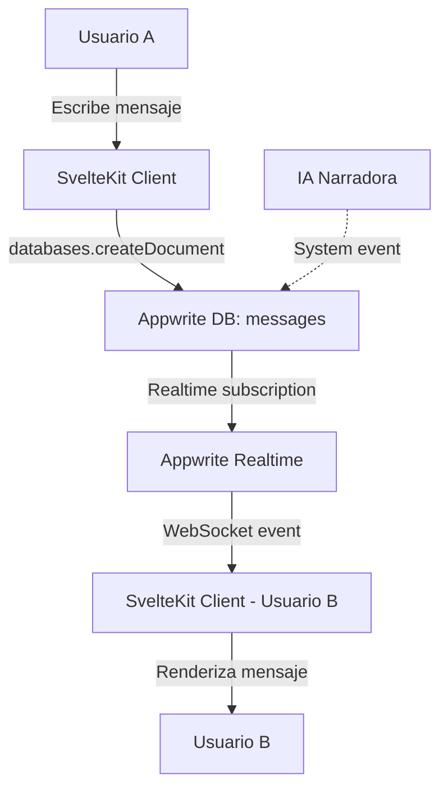
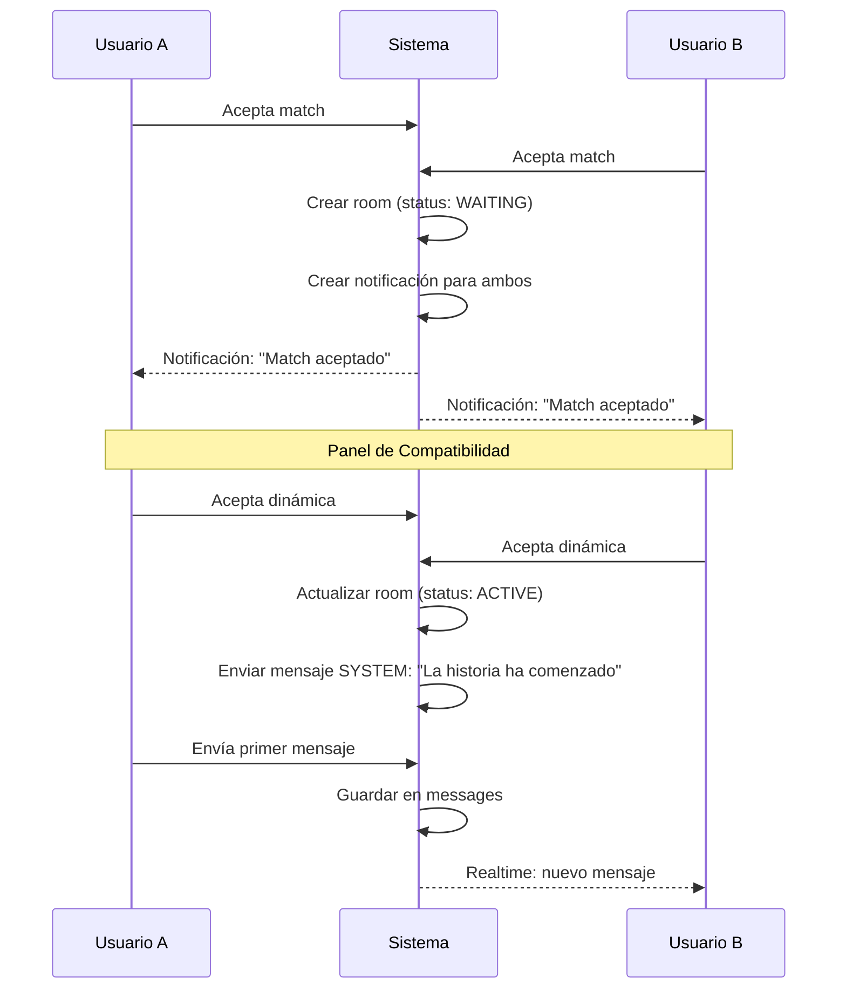

# 💬 Real-time & Chat Plan — Sexteo Platform

> **Backend**: Appwrite Realtime (WebSocket)
> **Alternativa futura**: Socket.io sobre servidor propio para features avanzadas

---

## 1. Arquitectura del Chat en Tiempo Real



### 1.1 Stack Técnico

| Componente | Tecnología | Fase |
|-----------|-----------|------|
| Chat base | Appwrite Realtime + Databases | Fase 1 |
| Typing indicator | Svelte store + Appwrite Realtime | Fase 1 |
| IA Narradora | Appwrite Functions + OpenAI API | Fase 2+ |
| Voice RP (audio) | WebRTC / MediaRecorder API | Post-MVP |
| Presencia online | Appwrite Realtime subscriptions | Fase 2 |

---

## 2. Modelo de Datos para Chat

### 2.1 Mensajes (colección `messages`)

```
messageId         string(36)    PK
roomId            string(36)    FK → rooms
senderId          string(36)    FK → users
characterId       string(36)    FK → characters  
content           string(5000)  Contenido
messageType       string(20)    ACTION | DIALOGUE | NARRATION | SYSTEM | AI_EVENT
isNarratorAI      boolean       ¿Es de la IA?
mediaFileId       string(50)    Adjunto opcional
createdAt         datetime      Timestamp
```

### 2.2 Clasificación de Mensajes

| Tipo | Formato en UI | Ejemplo |
|------|--------------|---------|
| ACTION | *Itálica con fondo* | *camina lentamente hacia la puerta* |
| DIALOGUE | Texto normal con guión | —No te atrevas a seguirme. |
| NARRATION | Texto descriptivo | La habitación se iluminó con un resplandor azul. |
| SYSTEM | Badge de sistema | 🔔 Luna se ha unido a la historia |
| AI_EVENT | Badge narrador con ícono | 🎭 Un ruido lejano interrumpe el silencio... |

### 2.3 Detección Automática de Tipo

```javascript
function detectMessageType(content) {
    if (content.startsWith('*') && content.endsWith('*')) return 'ACTION';
    if (content.startsWith('—') || content.startsWith('-')) return 'DIALOGUE';
    if (content.startsWith('[NARR]') || content.startsWith('>')) return 'NARRATION';
    return 'DIALOGUE'; // default
}
```

---

## 3. Suscripciones en Tiempo Real

### 3.1 Suscripción a Mensajes de un Room

```javascript
import { client } from '$lib/appwrite';

function subscribeToRoom(roomId, onMessage) {
    const channel = `databases.sexteo_main.collections.messages.documents`;
    
    return client.subscribe(channel, (event) => {
        const message = event.payload;
        if (message.roomId === roomId) {
            onMessage(message);
        }
    });
}

// Uso en componente Svelte:
// const unsubscribe = subscribeToRoom(roomId, (msg) => messages.push(msg));
// onDestroy(() => unsubscribe());
```

### 3.2 Indicador de "Escribiendo"

Appwrite no tiene typing indicators nativos. Implementación con un documento temporal:

```javascript
// Colección auxiliar: typing_indicators (en memoria, no persistente)
// O usar un approach client-side con Appwrite Realtime

// Opción 1: Documento temporal en una colección ligera
async function setTyping(roomId, userId, isTyping) {
    const docId = `${roomId}_${userId}`;
    try {
        await databases.updateDocument(DB.MAIN, 'typing_status', docId, {
            isTyping,
            updatedAt: new Date().toISOString(),
        });
    } catch {
        await databases.createDocument(DB.MAIN, 'typing_status', docId, {
            roomId, userId, isTyping,
            updatedAt: new Date().toISOString(),
        });
    }
}

// Suscripción al typing
function subscribeToTyping(roomId, onTyping) {
    return client.subscribe(
        `databases.sexteo_main.collections.typing_status.documents`,
        (event) => {
            const data = event.payload;
            if (data.roomId === roomId) {
                onTyping(data.userId, data.isTyping);
            }
        }
    );
}
```

**Alternativa más eficiente**: No persistir el typing status sino usar presencia de Appwrite Realtime si está disponible.

### 3.3 Presencia Online

```javascript
function subscribeToUserPresence(userId, onStatusChange) {
    // Appwrite no tiene presencia nativa, se simula con:
    // 1. Actualizar lastActiveAt cada 30 segundos
    // 2. Considerar "online" si lastActiveAt < 60 segundos

    const heartbeat = setInterval(async () => {
        await databases.updateDocument(DB.MAIN, 'users', userId, {
            isOnline: true,
            lastActiveAt: new Date().toISOString(),
        });
    }, 30000);

    return () => clearInterval(heartbeat);
}
```

---

## 4. Flujo del Chat

### 4.1 Iniciar Historia



### 4.2 Enviar Mensaje

```javascript
async function sendMessage(roomId, content, characterId) {
    const messageType = detectMessageType(content);
    
    const message = await databases.createDocument(
        DB.MAIN, 'messages', ID.unique(),
        {
            roomId,
            senderId: currentUserId,
            characterId,
            content,
            messageType,
            isNarratorAI: false,
            createdAt: new Date().toISOString(),
        },
        [
            Permission.read(Role.users()),
        ]
    );

    // Actualizar room stats
    await databases.updateDocument(DB.MAIN, 'rooms', roomId, {
        messageCount: { $inc: 1 }, // Nota: Appwrite no soporta $inc, se hace client-side
        lastMessageAt: new Date().toISOString(),
    });

    return message;
}
```

### 4.3 Recibir Mensajes

```javascript
// En el componente de chat (Svelte)
let messages = $state([]);

onMount(async () => {
    // 1. Cargar mensajes existentes
    const existing = await databases.listDocuments(
        DB.MAIN, 'messages',
        [
            Query.equal('roomId', roomId),
            Query.orderAsc('createdAt'),
            Query.limit(100),
        ]
    );
    messages = existing.documents;

    // 2. Suscribirse a nuevos mensajes
    const unsubscribe = client.subscribe(
        `databases.sexteo_main.collections.messages.documents`,
        (event) => {
            if (event.events.includes('databases.*.collections.messages.documents.*.create')) {
                const msg = event.payload;
                if (msg.roomId === roomId) {
                    messages = [...messages, msg];
                }
            }
        }
    );

    return () => unsubscribe();
});
```

---

## 5. Pausa Emocional

### 5.1 Flujo de Pausa

```javascript
async function activateEmotionalPause(roomId, userId) {
    // 1. Actualizar estado del room
    await databases.updateDocument(DB.MAIN, 'rooms', roomId, {
        status: 'PAUSED',
    });

    // 2. Enviar mensaje de sistema
    await sendSystemMessage(roomId, `⏸️ ${userName} ha activado una pausa emocional`);

    // 3. Actualizar estado del usuario
    await databases.updateDocument(DB.MAIN, 'users', userId, {
        globalState: 'EMOTIONAL_PAUSE',
    });

    // 4. Notificar contraparte
    await createNotification(partnerId, {
        type: 'SYSTEM',
        title: 'Pausa emocional activada',
        body: 'Tu compañero/a necesita un momento. La historia está en pausa.',
        referenceId: roomId,
        referenceType: 'ROOM',
    });

    // 5. Registrar evento analytics
    await logAnalyticsEvent('PAUSE_ACTIVATED', userId, { roomId });
}
```

---

## 6. Finalización de Historia

```javascript
async function proposeFinish(roomId, userId) {
    await sendSystemMessage(roomId, `📖 ${userName} propone finalizar la historia`);
    // Esperar aceptación del otro usuario
}

async function confirmFinish(roomId) {
    // 1. Marcar room como finalizada
    await databases.updateDocument(DB.MAIN, 'rooms', roomId, {
        status: 'FINISHED',
        finishedAt: new Date().toISOString(),
    });

    // 2. Actualizar estado de ambos usuarios
    for (const participantId of room.participantIds) {
        await databases.updateDocument(DB.MAIN, 'users', participantId, {
            globalState: 'EXPLORING',
            storiesCompleted: { $inc: 1 },
        });
    }

    // 3. Activar flujo de feedback
    await createFeedbackPrompt(roomId);

    // 4. Analytics
    await logAnalyticsEvent('STORY_FINISHED', null, {
        roomId,
        duration: calculateDuration(room.startedAt, room.finishedAt),
        messageCount: room.messageCount,
    });
}
```

---

## 7. IA Narradora (Fase 2+)

### 7.1 Triggers de Intervención

| Trigger | Condición | Acción |
|---------|-----------|--------|
| Silencio prolongado | Sin mensajes > 5 min | Sugerir giro de trama |
| Conversación lineal | Baja variedad narrativa | Introducir evento |
| Intensidad decae | Mensajes más cortos progresivamente | Personaje NPC |
| Solicitud explícita | Usuario pide intervención | Narrador directo |

### 7.2 Tipos de Intervención

```javascript
const AI_INTERVENTIONS = {
    PLOT_TWIST: {
        type: 'AI_EVENT',
        template: 'Un ruido inesperado rompe el silencio...',
    },
    NPC_ENTRY: {
        type: 'AI_EVENT', 
        template: 'Una figura misteriosa aparece en la escena...',
    },
    CHALLENGE: {
        type: 'AI_EVENT',
        template: 'El entorno cambia dramáticamente...',
    },
};
```

### 7.3 Implementación como Appwrite Function

```
Trigger: Cron job cada 5 minutos O webhook de actividad
Input:   roomId, últimos N mensajes, perfiles de usuarios
Proceso: Analizar contexto con LLM (GPT-4 / Claude)
Output:  Mensaje AI_EVENT insertado en la colección messages
```

---

## 8. Paginación de Mensajes

```javascript
async function loadOlderMessages(roomId, lastMessageId) {
    return databases.listDocuments(
        DB.MAIN, 'messages',
        [
            Query.equal('roomId', roomId),
            Query.orderDesc('createdAt'),
            Query.cursorAfter(lastMessageId),
            Query.limit(50),
        ]
    );
}
```

---

## Notas de Implementación

> [!WARNING]
> **Appwrite Realtime** usa WebSocket y puede tener limitaciones de conexiones simultáneas en el plan Cloud Free. Monitorear uso.

> [!IMPORTANT]
> Appwrite no soporta `$inc` para atomicidad en contadores. El `messageCount` del room debe actualizarse con read-then-write (posible race condition a alto tráfico). Considerar Appwrite Functions para operaciones atómicas.

> [!NOTE]
> Para el MVP, el typing indicator puede ser simplemente un debounced update al documento del room. La solución con colección dedicada `typing_status` es para escala.
